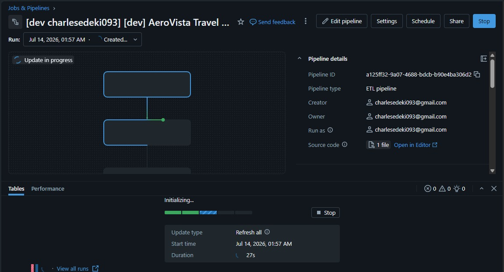
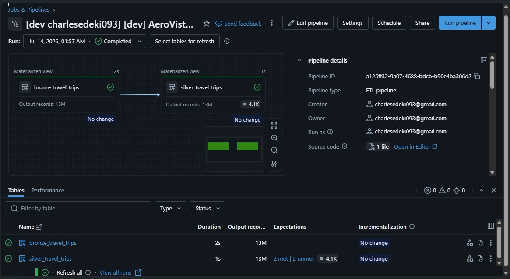

# AeroVista Ingestion Challenge

## Overview
This project implements a Bronze-to-Silver data transformation pipeline for AeroVista travel trip data using Databricks Asset Bundles (DABs) and Delta Live Tables (DLT).

## Project Structure
```
aerovista-ingestion-challenge/
├── lakehouse/
│   ├── Bronze.ipynb                     # Bronze layer ingestion notebook
│   ├── Silver.ipynb                     # Silver layer transformation notebook
│   └── aerovista-pipeline-bundle/
│       ├── databricks.yml               # DABs configuration
│       └── src/
│           └── travel_etl_pipeline_notebook  # DLT pipeline notebook
└── README.md
```

## Data Architecture

### Bronze Layer
- **Catalog**: `aerovista_bootcamp`
- **Schema**: `bronze`
- **Table**: `travel_trips` - Pipeline source reference
- **Source**: NYC taxi trip data (January 2015)
- **Row Count**: 12,749,986 records

### Silver Layer
- **Catalog**: `aerovista_bootcamp`
- **Schema**: `silver`
- **Table**: `travel_trips` - Cleaned and transformed trip data

## Transformations Applied

### Date/Time Extraction
- **`date`**: Extracted from `tpep_pickup_datetime`
- **`pickup_time`**: Time component from `tpep_pickup_datetime` (HH:mm:ss format)
- **`dropoff_date`**: Extracted from `tpep_dropoff_datetime`
- **`dropoff_time`**: Time component from `tpep_dropoff_datetime` (HH:mm:ss format)

### Data Quality Rules (Expectations)
The pipeline applies the following quality checks and **drops** invalid records:
1. **Valid pickup coordinates**: `pickup_longitude IS NOT NULL AND pickup_latitude IS NOT NULL`
2. **Valid dropoff coordinates**: `dropoff_longitude IS NOT NULL AND dropoff_latitude IS NOT NULL`
3. **Valid fare amount**: `fare_amount >= 0`
4. **Valid total amount**: `total_amount >= 0`

### Column Reordering
Reordered columns to prioritize date/time fields:
```
[date, pickup_time, dropoff_date, dropoff_time, VendorID, passenger_count, ...]
```

### Performance Optimizations
- Used `.withColumns()` instead of chained `.withColumn()` calls for better query planning
- Cached column list before list comprehension to avoid repeated RPC calls

## Results & Observations

### Data Quality Impact
- **Bronze rows**: 12,749,986
- **Silver rows**: 12,744,914
- **Filtered out**: 4,072 rows (0.032%)
  - Invalid coordinates
  - Negative fare/total amounts

### Null Value Analysis
- **`improvement_surcharge`**: 3 null values out of 12,744,914 rows (0.00002%)
- **Impact**: The 3 rows in this case are negligible as they do not affect analytics or aggregations. Although, depending on business requirements they can be treated accordingly.
- **Decision**: The rows having the null values are left untouched.

## Pipeline Deployment with DABs

### Configuration
The pipeline is deployed using **Databricks Asset Bundles** with the following settings:

**Bundle Configuration** (`databricks.yml`):
- **Bundle name**: `aerovista-travel-pipeline`
- **Compute**: Serverless (required by workspace policy)
- **Target environments**: `dev` (development), `prod` (production)
- **Variables**: `catalog`, `bronze_schema`, `silver_schema`

**Pipeline Settings**:
- **Name**: `[dev] AeroVista Travel ETL Pipeline`
- **Channel**: CURRENT
- **Photon**: Enabled
- **Development mode**: True
- **Continuous**: False (triggered runs only)

### Key Configuration Fixes
1. **Serverless compute requirement**: Changed from custom cluster config to `serverless: true`
2. **Catalog specification**: Added `catalog: ${var.catalog}` (required for serverless pipelines)
3. **Notebook path**: Used proper Databricks notebook instead of `.py` file
4. **YAML syntax**: Quoted template variables like `"{{workspace.host}}"`

## Technical Details

### Delta Live Tables (DLT) Functions Used
- `@dlt.table()` - Define streaming/materialized view tables
- `@dlt.expect_all_or_drop()` - Data quality expectations with auto-filtering
- `dlt.read()` - Read from upstream DLT tables

### PySpark Optimizations
- `withColumns()` for batch column transformations
- Column list caching to minimize RPC calls
- Early schema validation

### Data Quality Approach
- **Fail strategy**: DROP (invalid records are excluded, not failed)
- **Quality level**: Silver (cleaned and validated)
- **Auto-optimize**: Enabled for managed optimization


## Commands Reference

### Bundle Operations
```bash
# Validate configuration
databricks bundle validate --strict --target dev

# Deploy to development
databricks bundle deploy --target dev

# Deploy to production
databricks bundle deploy --target prod

# View deployment summary
databricks bundle summary --target dev
```





## Lessons Learned

### 1. Workspace Policies
- This workspace **requires serverless compute** for pipelines
- Custom cluster configurations are not allowed
- Must specify `catalog` when using serverless

### 2. DABs File Format
- Pipeline libraries must reference **Databricks notebooks**, not plain `.py` files
- YAML template variables starting with `{` must be quoted
- Source-linked deployment references working tree files directly

### 3. Performance Optimization
- Use `.withColumns()` for multiple column additions (better than chaining)
- Cache `.columns` property before using in loops/comprehensions
- DLT handles optimization automatically with `pipelines.autoOptimize.managed`

### 4. Managed table behaviour
- because it is managed by unity catalog, when dropped, everything is permanently deleted from databricks, unlike external tables that still has its source intact wherever it originally was in the cloud.

## Author
Charles Edeki (charlesedeki093@gmail.com)

## Date
Created: 2026-07-14
Last Updated: 2026-07-14